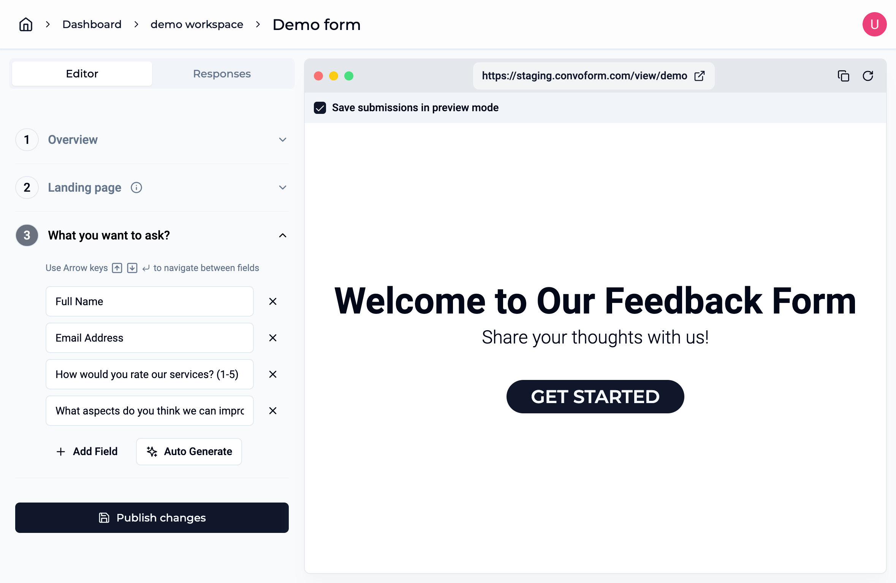

# ConvoForm

Imagine Google Forms, but supercharged with AI for an improved user experience,
Build engaging and interactive forms that are easy to fill and fun to answer.
You can see live demo here - [ConvoForm.com](https://www.convoform.com/).

## Features

- **User-Friendly Interface:** The interface is designed to be user-friendly,
  ensuring a seamless and efficient form-building experience.

- **Intelligent Field Input:** Creating form fields is made easy; users can
  provide the necessary information without worrying about specifying exact
  field names.

- **Dynamic Form Rendering:** The form view page dynamically displays questions
  based on the provided form summary, eliminating the need for users to
  predefine every field.
- **Customizable Welcome Screen:** Users have the flexibility to personalize the
  welcome screen that greets users before they start filling out the form,
  enhancing the user experience.

## Learnings
In the course of working on ConvoForm.com, I penned down two insightful pieces on Medium reflecting on my journey and learning:

- [A Comprehensive Guide to Easily Switch from Prisma to Drizzle ORM](https://medium.com/@growupanand/a-comprehensive-guide-to-easily-switch-from-prisma-to-drizzle-orm-c290f8ed8ef3)

- [Transitioning from Monorepo to Turborepo: My Development Journey with ConvoForm.com](https://medium.com/@growupanand/transitioning-from-monorepo-to-turborepo-my-development-journey-with-convoform-com-691b9d19f397)

Feel free to delve in, and I hope these articles provide value to your coding journey.

## Local Setup

Follow these steps to set up the project locally on your machine.

### Prerequisites

- Make sure you have the following installed:

    - [Node.js](https://nodejs.org/) (v18.17.1 or higher)
    - [pnpm](https://pnpm.io/) (v8.14.3 or higher)
    - [Git](https://git-scm.com/)

- You need a PostgreSQL database instance to store the customer data. Create a free superbase Postgres instance at [Supabase](https://supabase.com).

- [Clerk](clerk.com) is used for Authentication and User Management. Please make sure you Enable organizations in Organizations Settings within Clerk settings.

- Get your OpenAI key at [OpenAI Dashboard](https://platform.openai.com/api-keys)

- You need a Redis Database from [Upstash](https://upstash.com)

- Application Performance Monitoring & Error Tracking is done using [Sentry](https://sentry.io)


### Clone the Repository

```bash
git clone https://github.com/growupanand/ConvoForm.git
cd ConvoForm
```

### Install Dependencies

```bash
pnpm install
```

### Configuration

1. Copy the .env.example file to .env.local file.
   ```bash
   cp .env.example .env.local
   ```
2. Open the `.env.local` file and update the necessary environment variables.

### Run the Development Server

```bash
pnpm run dev
```

Visit [http://localhost:3000](http://localhost:3000/) in your browser to see the
application.

### Build for Production

```bash
pnpm run build
```

## Screenshots

Here are some screenshots from the app

| Workspace Page                                                                                                   | Form Submission                                                                                                   |
| ---------------------------------------------------------------------------------------------------------------- | ----------------------------------------------------------------------------------------------------------------- |
|  |  |

| Form Editor                                                | View Submissions                                               |
| ---------------------------------------------------------- | -------------------------------------------------------------- |
|  |  |

## Contributing

Feel free to contribute to the development by opening issues, providing
feedback, or submitting pull requests. Your input is valuable in making Smart
Form Wizard even smarter!
