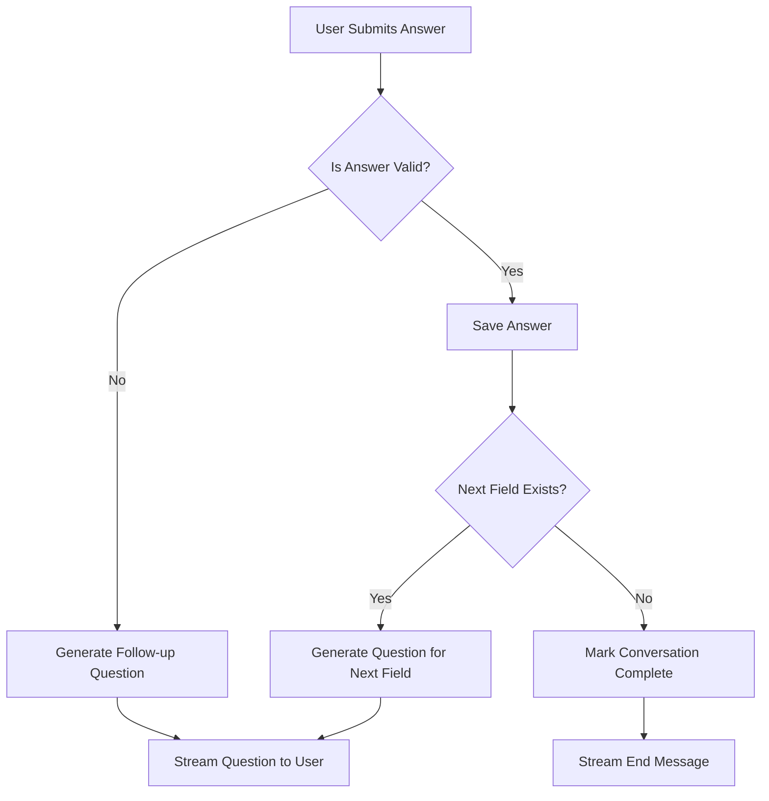

# ConvoForm Conversation Flow

This page explains how ConvoForm orchestrates the conversation between the user and the AI.

## Flow Diagram

## Explanation

1. **User Answer**: The user inputs text in response to a question.
2. **Validation**: The AI evaluates if the answer satisfies the current field requirements within the context of the conversation.
3. **Branching**:
    - **Invalid**: The AI generates a polite follow-up question to nudge the user towards a valid answer.
    - **Valid**: The answer is stored, and the system moves to the *Next Field*.
4. **Completion**: When all fields are collected, the conversation is marked as complete and a success message is shown.
