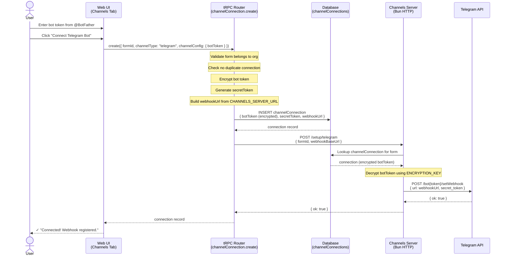
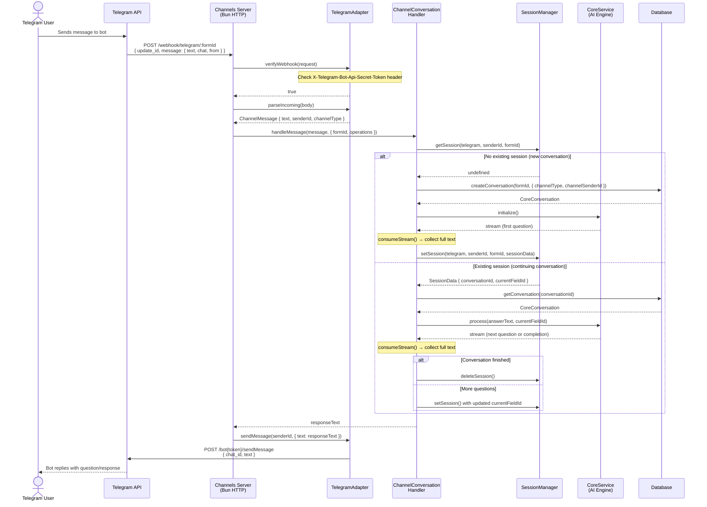

# Telegram Channel Flow

## 1. Setup Flow (One-Time)



## 2. Message Flow (Per Conversation)



## 3. Architecture Overview

```mermaid
graph TB
    subgraph "Web App (Next.js)"
        UI[Channels Tab UI]
        TRPC[tRPC Router<br/>channelConnection]
    end

    subgraph "Channels Server (Bun)"
        WH[Webhook Handler]
        SETUP[Setup Handler]
        SM[SessionManager<br/>In-Memory Map]
    end

    subgraph "Packages"
        CH[ChannelAdapter<br/>Abstract Class]
        TA[TelegramAdapter]
        CCH[ChannelConversation<br/>Handler]
    end

    subgraph "External"
        TGAPI[Telegram Bot API]
        TGUSER[Telegram Users]
    end

    subgraph "Shared"
        DB[(PostgreSQL)]
        CORE[CoreService<br/>AI Engine]
    end

    UI -->|create/update/delete| TRPC
    TRPC -->|auto-setup webhook| SETUP
    TRPC -->|read/write| DB

    TGUSER -->|message| TGAPI
    TGAPI -->|webhook POST| WH
    WH --> TA
    TA --> CCH
    CCH --> SM
    CCH --> CORE
    CCH -->|CRUD| DB
    TA -->|sendMessage| TGAPI
    TGAPI -->|reply| TGUSER

    SETUP -->|setWebhook| TGAPI
    SETUP -->|read config| DB

    CH -.->|extends| TA
