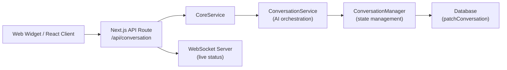
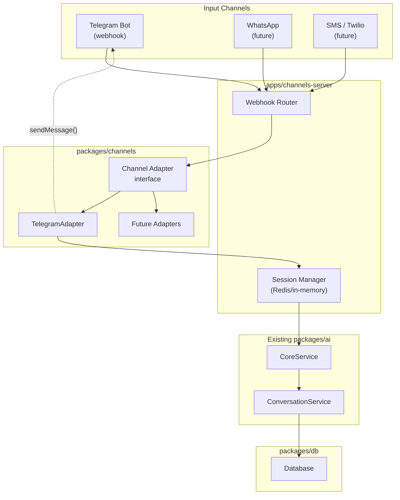

# Channels Architecture for Telegram Support

## Background & Current Architecture

ConvoForm's conversation flow today works like this:



| Layer | Location | Role |
|-------|----------|------|
| **Web client** | Widget / `@convoform/react` | Sends user answers, receives streamed AI questions |
| **API route** | `apps/web/src/app/api/conversation/route.ts` | HTTP endpoint, creates conversations, calls `CoreService` |
| **CoreService** | `packages/ai/src/services/coreService.ts` | Orchestrates `ConversationManager` + `ConversationService` |
| **ConversationService** | `packages/ai/src/services/conversationService.ts` | AI logic: stream questions, extract answers, manage field progression |
| **ConversationManager** | `packages/ai/src/managers/conversationManager.ts` | Pure state: tracks fields, transcript, answers |
| **Database** | `packages/db` (Drizzle + Postgres) | Persists conversations, forms, fields |
| **Integration** | `packages/integration` | **Output** integrations (Google Sheets) — fires `onResponse` after form completion |

> **Important:** The existing `IntegrationProvider` is for **output** integrations (push data somewhere after form submission). Telegram is an **input channel** — a fundamentally different concept. Channels need their own abstraction.

---

## Proposed Architecture: `packages/channels` + `apps/channels-server`

### Why a new package **and** a new app?

| Option | Pros | Cons |
|--------|------|------|
| Add to `apps/web` | No new deployment | Couples Telegram webhook lifecycle to Next.js, pollutes the web app with bot-specific logic |
| Add to `apps/websocket-server` | Already a standalone server | WebSocket server is purely for real-time browser sync, mixing concerns |
| **New `packages/channels`** + **`apps/channels-server`** ✅ | Clean separation, each channel is a pluggable adapter, server runs independently, scales per-channel | Extra deployment target |

### Architecture Overview



---

## Proposed Changes

### Channel Abstraction (`packages/channels`)

#### [NEW] `packages/channels/src/channel.ts`

Core abstract class that all channel adapters implement:

```typescript
export interface ChannelMessage {
  text: string;
  senderId: string;      // Channel-specific user ID (e.g. Telegram chat ID)
  channelType: string;   // 'telegram', 'whatsapp', etc.
  metadata?: Record<string, any>;
}

export interface ChannelResponse {
  text: string;
  metadata?: Record<string, any>;
}

export abstract class ChannelAdapter {
  abstract readonly channelType: string;

  /** Parse incoming webhook payload into a ChannelMessage */
  abstract parseIncoming(payload: unknown): ChannelMessage | null;

  /** Send a response back through the channel */
  abstract sendMessage(senderId: string, response: ChannelResponse): Promise<void>;

  /** Verify webhook signature/authenticity */
  abstract verifyWebhook(request: Request): Promise<boolean>;
}
```

#### [NEW] `packages/channels/src/adapters/telegram-adapter.ts`

Implements `ChannelAdapter` for Telegram using the [Telegram Bot API](https://core.telegram.org/bots/api).

#### [NEW] `packages/channels/src/session-manager.ts`

Maps `{channelType, senderId, formId}` → active `CoreConversation`. Since Telegram messages are stateless webhooks, we need to maintain session state between messages:
- **Phase 1**: In-memory Map (development)
- **Phase 2**: Redis (production, multi-instance)

#### [NEW] `packages/channels/src/channel-conversation-handler.ts`

The bridge between channels and `CoreService`. Key difference from the web flow: **no streaming** — channels collect the full AI response and send it as a single message.

```typescript
// Simplified flow:
// 1. Receive message from channel adapter
// 2. Look up or create session (conversation)
// 3. Call CoreService.process() or CoreService.initialize()
// 4. Collect full response (no streaming needed for Telegram)
// 5. Send response via channel adapter
```

---

### Channels Server (`apps/channels-server`)

#### [NEW] `apps/channels-server/src/index.ts`

Bun-based HTTP server (consistent with `apps/websocket-server`) that:
- Registers channel adapters
- Routes incoming webhooks to the correct adapter
- Handles health checks
- Exposes a webhook setup endpoint (for Telegram's `setWebhook`)

---

### Database Changes (`packages/db`)

#### [NEW] `packages/db/src/schema/channelConnections`

New table to link forms to channels:

| Column | Type | Description |
|--------|------|-------------|
| `id` | text (CUID) | Primary key |
| `formId` | text (FK → Form) | Which form this channel serves |
| `channelType` | text | `'telegram'`, `'whatsapp'`, etc. |
| `channelConfig` | jsonb | Channel-specific config (bot token, chat settings) |
| `enabled` | boolean | Toggle channel on/off |
| `organizationId` | text | Org that owns this |
| `createdAt` / `updatedAt` | timestamp | Standard timestamps |

#### [MODIFY] `packages/db/src/schema/conversations/conversation.ts`

Add optional `channelType` and `channelSenderId` columns to track which channel a conversation came from:

```diff
+ channelType: text("channelType"),        // 'web', 'telegram', etc.
+ channelSenderId: text("channelSenderId"), // Channel-specific user ID
```

---

### Web App Changes (`apps/web`)

#### [NEW] Channels management UI

A new section in the form settings where users can:
1. Connect a Telegram bot (enter bot token)
2. See the webhook URL to configure
3. Enable/disable the channel
4. View conversations filtered by channel

> **Note:** The web app UI for channel management is a follow-up phase. The core architecture should be built first.

---

## Implementation Phases

> **Rule:** Mark each phase's tasks as `[x]` once completed.

### Phase 1: Foundation ✅
- [x] Create `packages/channels` with `ChannelAdapter` interface and `SessionManager`
- [x] Create `ChannelConversationHandler` (bridge to `CoreService`)
- [x] Add `channelConnections` DB schema + migration
- [x] Add `channelType` / `channelSenderId` to conversation schema

### Phase 2: Telegram Adapter ✅
- [x] Implement `TelegramAdapter` in `packages/channels`
- [x] Create `apps/channels-server` (Bun HTTP server)
- [x] Wire up webhook routing
- [x] Test end-to-end: Telegram message → form question → answer → next question

### Phase 3: Web UI & Polish ✅
- [x] Add channel management UI in form settings
- [x] Add tRPC routes for CRUD on `channelConnections`
- [x] Filter conversations by channel in the dashboard
- [x] Add proper error handling, rate limiting, and security

### Phase 4: Scale & More Channels
- [ ] Redis-based session manager
- [ ] WhatsApp adapter (similar structure)
- [ ] SMS/Twilio adapter

---

## Key Design Decisions

1. **Non-streaming for channels**: Telegram/WhatsApp don't support streaming. The `ChannelConversationHandler` will consume the full `CoreService` stream internally and send one message.

2. **Reuse `CoreService` directly**: The AI orchestration logic is already channel-agnostic. We just need a different transport layer.

3. **Separate server**: Webhook-driven channels have different lifecycle requirements (long-polling fallback, webhook verification, different scaling patterns) than the web app.

4. **Session management**: The web widget maintains state client-side. Channel users don't have client state — the server must track which conversation each sender is in.

---

## Verification Plan

### Automated Tests
- Unit tests for `ChannelAdapter.parseIncoming()` with mock Telegram payloads
- Unit tests for `SessionManager` (create, retrieve, expire sessions)
- Integration test for `ChannelConversationHandler` using `MockLanguageModelV2` from `ai/test`

### Manual Verification
- Set up a test Telegram bot via BotFather
- Configure webhook to point to local `channels-server` (via ngrok/cloudflare tunnel)
- Send messages and verify the bot responds with form questions
- Complete a full form via Telegram and verify data in DB
